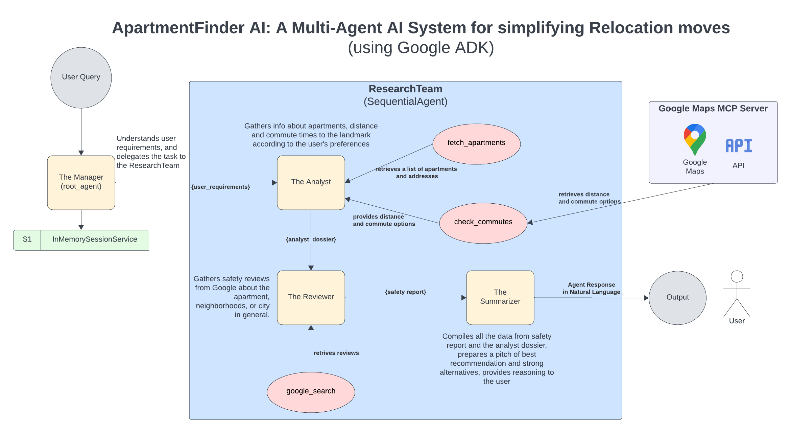

# 🏠 ApartmentFinder AI Agent

ApartmentFinder is an intelligent multi-agent system designed to simplify the chaos of relocating. Instead of juggling tabs between listing sites, Google Maps, and Reddit, users have a single conversation with an AI that finds apartments, calculates real commute times, vets neighborhood safety, and delivers a curated recommendation.

**Live:** [apartment-finder-ai.vercel.app](https://apartment-finder-ai.vercel.app) — Next.js frontend on Vercel, FastAPI/ADK backend on Cloud Run.

## The Problem

Relocating to a new city is overwhelming. A user typically has to:

1. Search listing sites for budget/amenities.
2. Copy addresses into Google Maps to check commute times during rush hour.
3. Search Google/Reddit to check if the neighborhood is safe.
4. Compile all this into a spreadsheet to make a decision.

This process is manual, fragmented, and time-consuming.

## The Solution

ApartmentFinder automates this entire pipeline using a hierarchical multi-agent architecture built on Google's Agent Development Kit (ADK).

A **Manager** agent interfaces with the user to gather requirements (city, state, budget, landmark, plus optional bedrooms/bathrooms/roommates). Once requirements are met, it delegates to a **Research Team** — a sequential chain of sub-agents that fetches real listings, checks live commute times, and vets neighborhood safety via web search — before handing off to a final synthesis step.

## Architecture



```
Manager (root_agent)          ← user talks only to this agent
  └── ResearchTeam (SequentialAgent)
        ├── Analyst           ← fetch_apartments + check_commutes
        ├── Reviewer          ← google_search (safety research)
        └── Summarizer        ← synthesis, final recommendation
```

1. **Manager (Root Agent)**
   - Role: User interface & requirement validator.
   - Behavior: Loops conversationally until it has secured the required fields (city, state, budget, landmark) and any optional ones the user volunteers. Handles follow-up changes mid-conversation (e.g. "actually make it $3,000") by re-resolving only the changed field and carrying the rest forward from session state.
   - Handoff: Only delegates to the ResearchTeam once requirements are stored.

2. **Research Team (Sequential Sub-Agent)**

   Executes a linear pipeline:

   - 🕵️ **Analyst Agent** — Calls `fetch_apartments` (live listings via RentCast and/or Apify's Zillow scraper, with automatic provider failover) and `check_commutes` (Google Maps Distance Matrix API, using resolved lat/lng coordinates rather than raw addresses). Emits a deterministic status signal when nothing matches, so downstream routing doesn't depend on the LLM phrasing "no results" correctly in prose.
   - 🛡️ **Reviewer Agent** — Runs one batched `google_search` covering every listing's neighborhood, then writes a per-apartment safety note.
   - 📝 **Summarizer Agent** — Synthesizes listings, commute data, and safety notes into a ranked, formatted recommendation.

## 🛠️ Tech Stack

- **Framework**: Google Agent Development Kit (ADK)
- **LLM**: Gemini 2.5 Flash (Analyst/Manager/Summarizer run on LiteLLM; Reviewer runs on Gemini directly for `google_search` grounding)
- **Listings**: RentCast API and/or Apify Zillow Scraper (provider chain, no offline fallback)
- **Maps**: Google Maps Distance Matrix + Places API (New) for landmark resolution and proximity search
- **Frontend**: Next.js 14 (Vercel)
- **Backend**: FastAPI (Cloud Run), streamed via Server-Sent Events
- **Observability**: Langfuse tracing (OpenTelemetry instrumentation across the full agent tree)
- **Quota persistence**: Firestore (survives Cloud Run cold starts) or local file store for dev

## Setup Instructions

### Prerequisites

- Python 3.10+
- A Google Cloud project with the following APIs enabled:
  - Geocoding API
  - Places API (New)
  - Distance Matrix API
  - Directions API
- At least one listings provider key: RentCast (free tier, 50 calls/month) and/or Apify

### Installation

1. Clone the repository:
```bash
git clone https://github.com/yourusername/apartment-finder-ai.git
cd apartment-finder-ai
```

2. Install Python dependencies:
```bash
python -m venv .venv
.venv\Scripts\activate   # Windows
pip install -r requirements.txt
```

3. Configure environment — create a `.env` file in the root directory:
```env
GOOGLE_API_KEY=your_gemini_api_key
GOOGLE_MAPS_API_KEY=your_google_maps_api_key
RENTCAST_API_KEY=your_rentcast_key     # at least one of RENTCAST/APIFY is required
APIFY_API_KEY=your_apify_key
```
See [CLAUDE.md](CLAUDE.md) for the full list of optional variables (Langfuse tracing, CORS, usage-store backend, etc).

## Usage

```bash
python main.py     # interactive CLI session
adk web             # ADK web UI (browser-based conversation)
```

Example interaction:
```
Agent: "Hello! I can help you relocate. Where are you moving?"
User: "I'm looking for a place in Austin, TX under $2500."
Agent: "Got it. Where will you be commuting to?"
User: "The Tesla Gigafactory."
Agent: (Thinking...) Delegates to Analyst -> Fetches listings -> Checks commutes -> Checks reviews...
Agent: "I found a great option for you! The Riverside Lofts are $2,100/month. The commute is 15 mins via car, and reviews indicate the neighborhood is improving..."
```

### Tests
```bash
python test_tools.py   # tests fetch_apartments and check_commutes directly
```

## 📂 Project Structure
```
apartment-finder-ai/
├── apartment_finder/
│   ├── __init__.py        # Re-exports root_agent for `adk web`
│   ├── agent.py            # Agent definitions
│   ├── instructions.py     # System prompts for Manager/Analyst/Reviewer/Summarizer
│   ├── tools.py             # fetch_apartments, check_commutes, store_requirements
│   └── tracing.py           # Langfuse/OpenTelemetry instrumentation
├── api/
│   ├── server.py             # FastAPI app (SSE streaming endpoints)
│   └── session_manager.py    # Session lifecycle, structured-intake path
├── frontend/                 # Next.js 14 app (deployed to Vercel)
├── data/                     # Usage-quota counters (file-backed dev store)
├── main.py                   # CLI entry point & runner
├── Dockerfile                 # Builds the API for Cloud Run
└── requirements.txt
```

## Deployment

The API deploys to Cloud Run and the frontend to Vercel, communicating directly over SSE (bypassing Vercel's serverless function timeout). See [CLAUDE.md](CLAUDE.md) for the full deployment guide, environment variables, and known operational trade-offs.
